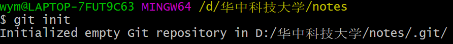
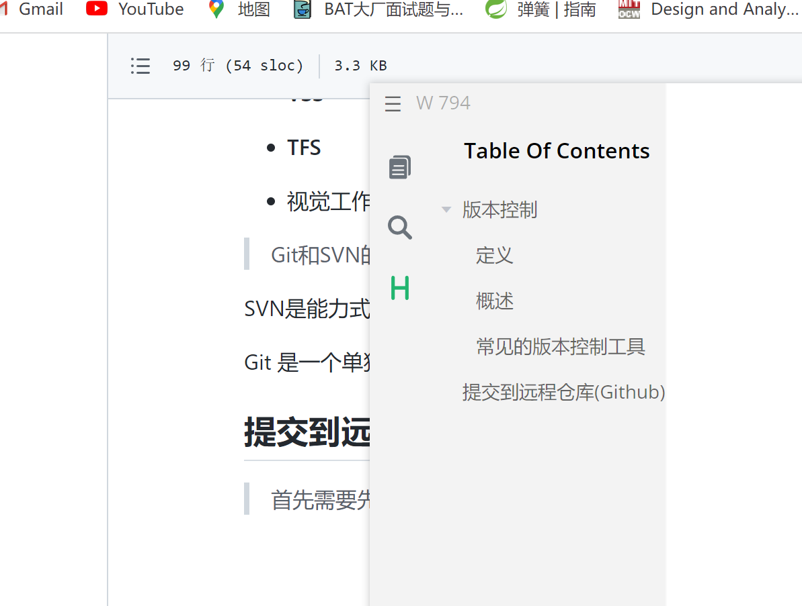
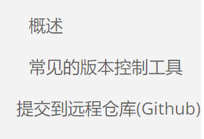

git学习笔记

学习git之前, 我们需要了解一个概念: 版本控制.

## 版本控制

### 定义

什么是版本控制?

让我们看看维基百科上的一段介绍：

> **版本控制**（英语：Version control）是维护工程[蓝图](https://zh.wikipedia.org/wiki/%E8%97%8D%E5%9C%96 "蓝图")的标准作法，能追踪工程蓝图从诞生一直到定案的过程。此外，版本控制也是一种[软件工程](https://zh.wikipedia.org/wiki/%E8%BB%9F%E9%AB%94%E5%B7%A5%E7%A8%8B "软件工程")技巧，借此能在软件开发的过程中，确保由不同人所编辑的同一程序文件都得到同步。

### 概述

透过文档控制（documentation control），能记录任何工程项目内各个模块的改动历程，并为每次改动编上序号。

一种简单的版本控制形式如下：赋给图的初版一个版本等级“A”。当做了第一次改变后，版本等级改为“B”，以此类推。最简单的例子是，最初的版本指定为“1”，当做了改变之后，版本编号增加为“2”，以此类推。

借此，版本控制能提供项目的设计者，将设计恢复到之前任一状态的选择权，这种选择权在设计过程进入死胡同时特别重要。

理论上所有的信息记录都可以加上版本控制，在过去的实务中，除了软件开发的流程，其它的领域中很少有使用较复杂的版本控制技巧与工具（虽然可能为其带来许多好处）。目前已有人开始用版本控制软件来管理CAD电子文件，电路板设计，来补足本来由人手工执行的传统版本控制。

### 常见的版本控制工具

> 我们学习的东西，一定是当下最**主流**的。

主流的版本控制器有如下这些：

- **Git**

- **SVN**

- **CVS**

- **VSS**

- **TFS**

- Visual Studio Online

> Git和SVN最主要的区别

SVN是集中式版本控制系统，版本库是集中放在中央服务器的，工作的时候用的是自己的电脑，需要联网才能工作。

Git是分布式版本控制系统，没有中央服务器，每个人的电脑就是一个完整的版本库。

## 提交到远程仓库(Github)

> 首先需要先将文件夹初始化为git仓库




出现.git文件夹就说明初始化成功。

> 将本地代码放入暂存区，输入git add .



> 输入git commit -m '提交信息', 把暂存区的文件放到版本库里。



> 然后到github上新建一个仓库
> 
> 新建完成后输入git remote add origin 链接


如果链接出错了就先把它删除掉.


然后重新完成上一步。

> 最后git push -u origin master就完成了。


再次更新的时候只需要以下步骤：

```shell
git add .
git commit -m '提交信息'
git push origin master
```

就行了。

如果查看当前状态还可以用

```shell
git status
```

来查看。
